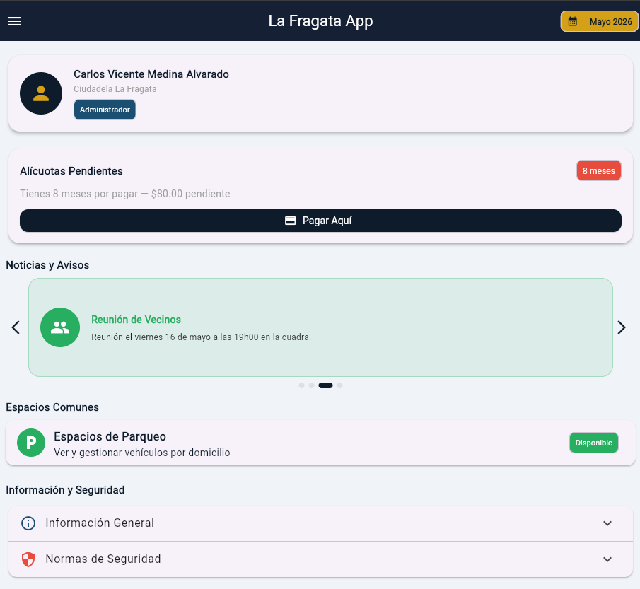
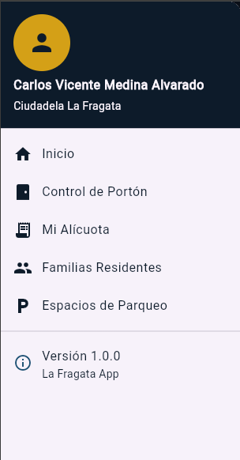
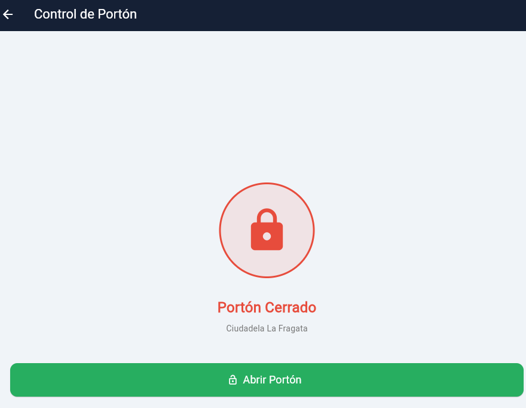
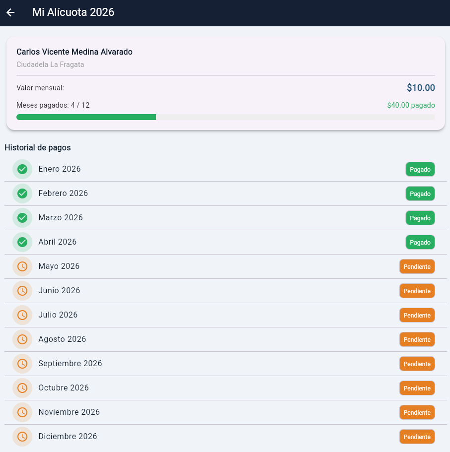
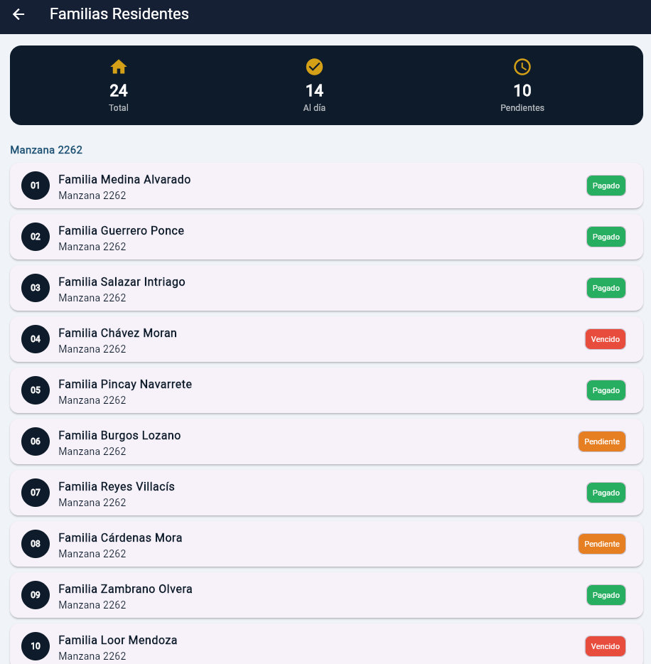
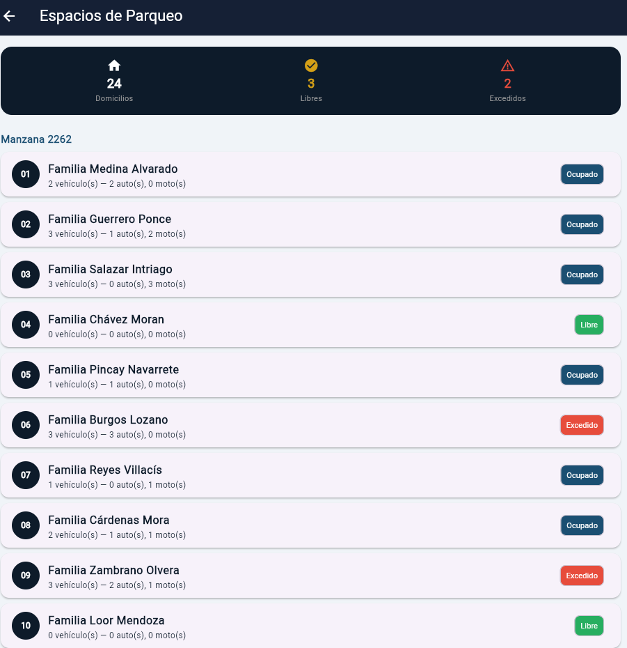
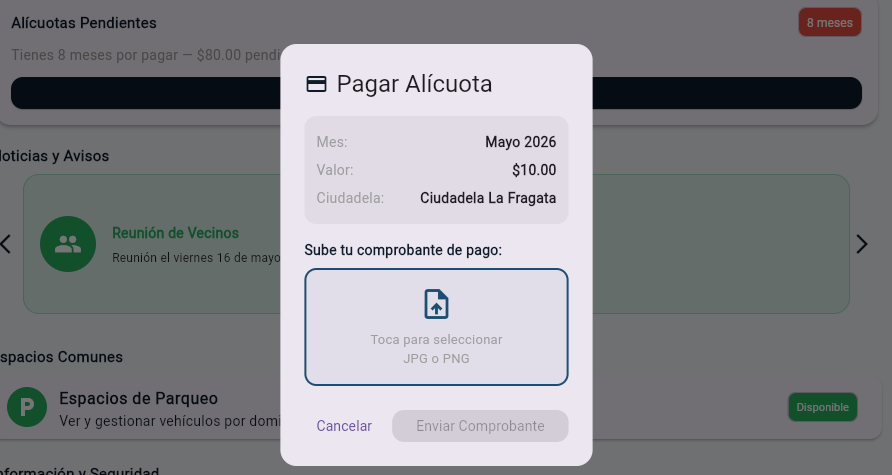
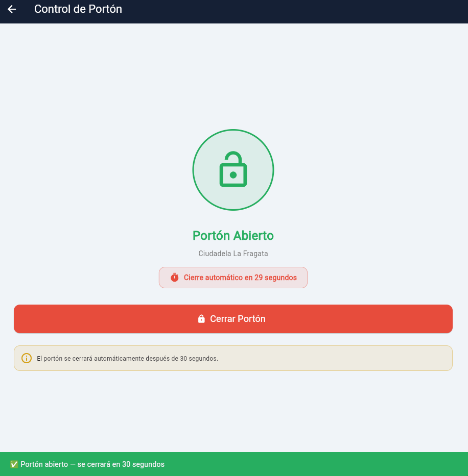
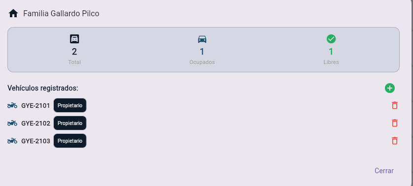
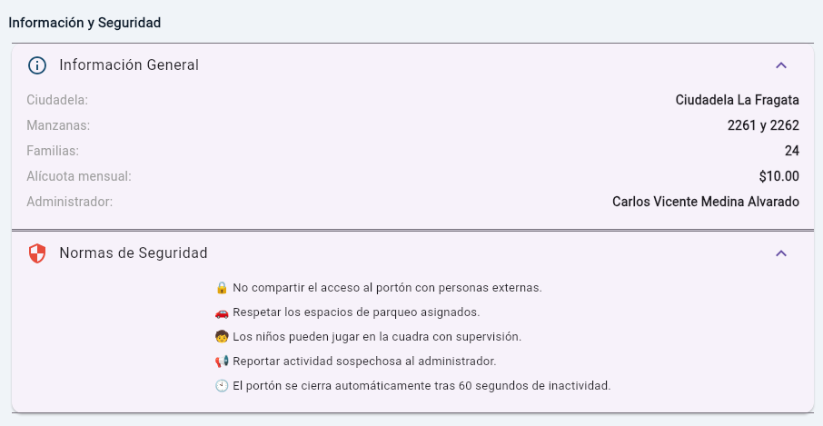

#  La Fragata App

**Desarrollado por:** Carlos Vicente Medina Alvarado  
**Materia:** Desarrollo de Aplicaciones Móviles - Actividad Integradora 2
**Universidad:** Universidad Tecnológica ECOTEC  
**Período:** 2026  

---

##  Descripción

**La Fragata App** es una aplicación móvil desarrollada en Flutter para la gestión digital de la **Ciudadela La Fragata** (Manzanas 2261 y 2262) ubicada en Guayaquil, Ecuador.

La app nace como solución real a un problema concreto: 24 familias compartían un único usuario de la app Smart Life para controlar el portón de la cuadra, sin control individual, sin registro de pagos y sin trazabilidad de vehículos.

---

##  Funcionalidades

| Módulo | Descripción |
|--------|-------------|
| Control de Portón | Abrir/cerrar el portón con cierre automático a los 60 segundos |
| Mi Alícuota | Historial de pagos mensuales con progreso anual |
| Familias Residentes | Lista de las 24 familias con estado de pago |
| Espacios de Parqueo | Registro y gestión de vehículos por domicilio |
| Noticias y Avisos | Carrusel de avisos de la ciudadela |
| Información y Seguridad | Normas y datos generales de la ciudadela |

---

## Tecnologías utilizadas

- **Flutter** — Framework de desarrollo móvil
- **Dart** — Lenguaje de programación
- **GitHub** — Control de versiones

---

## Widgets implementados

### Vistos en clase
- `ListView.separated` — listas con separadores
- `ListTile` — elementos de lista
- `AppBar` — barra de navegación superior
- `Navigator.pushNamed` — navegación entre pantallas
- `StatelessWidget` / `StatefulWidget` — widgets con y sin estado
- `Drawer` — menú lateral
- `AlertDialog` — diálogos de confirmación
- `SnackBar` — notificaciones en pantalla

### Nuevos implementados
- `PageView` — carrusel de noticias con flechas de navegación
- `LinearProgressIndicator` — barra de progreso de pagos anuales
- `AnimatedContainer` — animación del estado del portón
- `ExpansionTile` — secciones expandibles de información
- `UserAccountsDrawerHeader` — encabezado del menú lateral
- `CircleAvatar` — avatares circulares con íconos
- `Chip` — etiquetas de estado con color dinámico
- `Timer` — temporizador para cierre automático del portón
- `FilePicker` — selección de archivos para comprobante de pago

---

## Estructura del proyecto
```plaintext
lib/
├── main.dart
├── data/
│   └── datos_fragata.dart
├── models/
│   └── acceso_menu.dart
├── routes/
│   └── rutas_fragata.dart
├── theme/
│   └── tema_fragata.dart
└── screens/
    ├── home_screen.dart
    ├── alicuota_screen.dart
    ├── familias_screen.dart
    ├── espacios_screen.dart
    └── porton_screen.dart
```

---

## Capturas de pantalla

### Pantalla de Inicio


### Menú Lateral (Drawer)


### Control de Portón


### Mi Alícuota


### Familias Residentes.


### Espacios de Parqueo


### Pago de Alícuota con Comprobante


### Portón Abierto.


### Registro de Vehículos


### Información


---

## Cómo ejecutar el proyecto

```bash
# Clonar el repositorio
git clone https://github.com/camedina-byte/la_fragata_app.git

# Entrar a la carpeta
cd la_fragata_app

# Instalar dependencias
flutter pub get

# Ejecutar la app
flutter run
```

---

## Notas

- Los datos son estáticos (listas en Dart) acorde a lo solicitado
- El control del portón es simulado — en Fase 2 se conectará al motor real
- Las notificaciones de pago vía WhatsApp/correo están planificadas para Fase 2